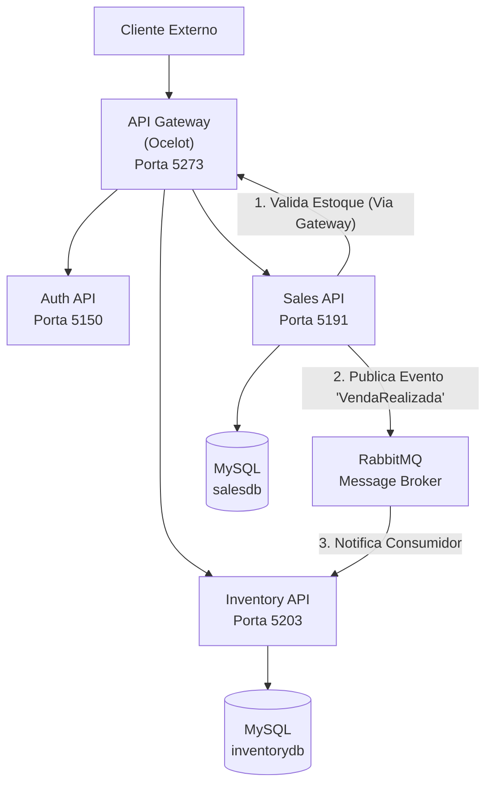

# 🛒 EcommerceProjeto

Um sistema de e-commerce moderno construído com arquitetura de microserviços, implementando padrões avançados de desenvolvimento e comunicação assíncrona entre serviços.

## 📋 Índice

- [Sobre o Projeto](#-sobre-o-projeto)
- [Arquitetura](#-arquitetura)
- [Tecnologias Utilizadas](#-tecnologias-utilizadas)
- [Estrutura do Projeto](#-estrutura-do-projeto)
- [Funcionalidades](#-funcionalidades)
- [Pré-requisitos](#-pré-requisitos)
- [Instalação e Configuração](#-instalação-e-configuração)
- [Como Executar](#-como-executar)
- [API Endpoints](#-api-endpoints)
- [Fluxo de Comunicação](#-fluxo-de-comunicação)
- [Testes](#-testes)
- [Contribuição](#-contribuição)
- [Autor](#-autor)

## 🎯 Sobre o Projeto

O **EcommerceProjeto** é uma aplicação de e-commerce desenvolvida com arquitetura de microserviços, demonstrando boas práticas de desenvolvimento de software moderno. O sistema é composto por múltiplos serviços independentes que se comunicam através de APIs REST e mensageria assíncrona, garantindo escalabilidade, manutenibilidade e alta disponibilidade.

### Características Principais:
- ✅ **Arquitetura de Microserviços** com separação clara de responsabilidades
- 🔐 **Autenticação JWT** para segurança das APIs
- 🌐 **API Gateway** centralizando o roteamento e autenticação
- 📨 **Comunicação Assíncrona** com RabbitMQ
- 🗄️ **Persistência de Dados** com Entity Framework Core e MySQL
- 📊 **Logging Estruturado** com Serilog
- 🧪 **Testes Unitários** implementados

## 🏗️ Arquitetura



## 🛠️ Tecnologias Utilizadas

### Backend
- **.NET 9.0** - Framework principal
- **ASP.NET Core Web API** - Para criação das APIs REST
- **Entity Framework Core** - ORM para persistência de dados
- **MySQL** - Banco de dados relacional

### Infraestrutura e Comunicação
- **Ocelot** - API Gateway
- **RabbitMQ** - Message Broker para comunicação assíncrona
- **JWT (JSON Web Tokens)** - Autenticação e autorização
- **Serilog** - Logging estruturado

### Testes
- **xUnit** - Framework de testes

### Ferramentas de Desenvolvimento
- **Swagger/OpenAPI** - Documentação de APIs
- **Microsoft.Extensions.Http** - Cliente HTTP para comunicação entre serviços

## 📁 Estrutura do Projeto

```
EcommerceProjeto/
├── 📁 ApiGateway/                 # Gateway central das APIs
│   ├── ocelot.json               # Configuração de roteamento
│   ├── Program.cs                # Configuração do gateway
│   └── appsettings.json          # Configurações JWT
│
├── 📁 Auth.API/                   # Serviço de Autenticação
│   ├── Controllers/              # Controllers de autenticação
│   ├── Services/                 # Serviços de token
│   ├── Models/                   # Modelos de usuário
│   └── DTOs/                     # Data Transfer Objects
│
├── 📁 Inventory.API/              # Serviço de Estoque
│   ├── Controllers/              # CRUD de produtos
│   ├── Services/                 # Consumidor de mensagens
│   ├── Models/                   # Modelos de produto
│   ├── Data/                     # Contexto do banco
│   └── Migrations/               # Migrações EF Core
│
├── 📁 Sales.API/                  # Serviço de Vendas
│   ├── Controllers/              # Processamento de pedidos
│   ├── Services/                 # Produtor de mensagens
│   ├── Models/                   # Modelos de pedido
│   ├── Data/                     # Contexto do banco
│   └── Migrations/               # Migrações EF Core
│
├── 📁 Auth.API.Tests/             # Testes unitários
│   └── TokenServiceTests.cs      # Testes do serviço de token
│
└── EcommerceProjeto.sln          # Solução do Visual Studio
```

## ⚡ Funcionalidades

### 🔐 Autenticação (Auth.API)
- **Login de usuários** com validação de credenciais
- **Geração de tokens JWT** para autenticação
- **Usuários pré-cadastrados** para demonstração

### 📦 Gestão de Estoque (Inventory.API)
- **CRUD completo de produtos** (Create, Read, Update, Delete)
- **Controle de quantidade em estoque**
- **Atualização automática de estoque** via mensageria
- **Validação de dados** com Data Annotations

### 🛒 Processamento de Vendas (Sales.API)
- **Criação de pedidos** com múltiplos itens
- **Validação de produtos** via comunicação com Inventory.API
- **Cálculo automático de totais**
- **Publicação de eventos** para atualização de estoque

### 🌐 Gateway de APIs
- **Roteamento centralizado** para todos os serviços
- **Autenticação JWT** em rotas protegidas
- **Logging de requisições** com Serilog
- **Configuração flexível** via Ocelot

## 📋 Pré-requisitos

Antes de executar o projeto, certifique-se de ter instalado:

- **.NET 9.0 SDK** ou superior
- **MySQL Server** (versão 8.0 ou superior)
- **Docker Desktop** (para rodar o RabbitMQ)
- **Visual Studio 2022** ou **Visual Studio Code** (recomendado)
- **Git** (para clonagem do repositório)

## 🚀 Instalação e Configuração

### 1. Clone o repositório
```bash
git clone https://github.com/seu-usuario/EcommerceProjeto.git
cd EcommerceProjeto
```

### 2. Inicie o RabbitMQ
Com o Docker em execução, inicie o container do RabbitMQ:
```bash
docker run -d --hostname my-rabbit --name some-rabbit -p 5672:5672 -p 15672:15672 rabbitmq:3-management
```

### 3. Configure o MySQL
Crie os bancos de dados. Por simplicidade, o Auth.API não utiliza banco neste projeto.
```sql
CREATE DATABASE inventorydb;
CREATE DATABASE salesdb;
```

### 4. Configure as Connection Strings
Atualize os arquivos `appsettings.json` em cada projeto com suas credenciais do MySQL:

**Inventory.API/appsettings.json:**
```json
{
  "ConnectionStrings": {
    "DefaultConnection": "Server=localhost;Database=inventorydb;Uid=seu_usuario;Pwd=sua_senha;"
  }
}
```

**Sales.API/appsettings.json:**
```json
{
  "ConnectionStrings": {
    "DefaultConnection": "Server=localhost;Database=salesdb;Uid=seu_usuario;Pwd=sua_senha;"
  }
}
```

### 5. Instale as dependências
Na pasta raiz da solução:
```bash
dotnet restore
```

### 6. Execute as migrações
Execute os comandos dentro da pasta de cada projeto respectivo.
```bash
# No diretório Inventory.API
dotnet ef database update

# No diretório Sales.API
dotnet ef database update
```

## ▶️ Como Executar

### Opção 1: Visual Studio
1. Abra o arquivo `EcommerceProjeto.sln` no Visual Studio
2. Clique com o botão direito na Solução e selecione "Configure Startup Projects..."
3. Marque "Multiple startup projects" e defina a Ação como "Start" para:
   - **ApiGateway**
   - **Auth.API**
   - **Inventory.API**
   - **Sales.API**
4. Pressione **F5**

### Opção 2: Terminal/Command Line
Execute cada serviço em terminais separados, a partir da pasta raiz da solução:

```bash
# Execute cada comando em um terminal separado, a partir da pasta raiz da solução:

dotnet run --project ApiGateway
dotnet run --project Auth.API
dotnet run --project Inventory.API
dotnet run --project Sales.API
```

### Verificar se os serviços estão funcionando:
- **API Gateway** (Ponto de Entrada Principal): http://localhost:5273
- **Auth API** (Swagger): http://localhost:5150/swagger
- **Inventory API** (Swagger): http://localhost:5203/swagger
- **Sales API** (Swagger): http://localhost:5191/swagger

## 🔗 API Endpoints

Todas as chamadas devem ser feitas para o endereço do API Gateway: http://localhost:5273

### Autenticação
```http
POST /auth/login
Content-Type: application/json

{
  "username": "bruno",
  "password": "123"
}
```
> **Nota:** Para fins de demonstração, este projeto utiliza uma lista de usuários fixa em memória. As credenciais válidas são:
> * **Usuário:** `bruno`, **Senha:** `123` (simulando um cliente)
> * **Usuário:** `admin`, **Senha:** `admin` (simulando um administrador)

### Produtos (através do Gateway)
```http
# Listar produtos
GET /inventory/products
Authorization: Bearer {seu_token_jwt}

# Criar produto
POST /inventory/products
Authorization: Bearer {seu_token_jwt}
Content-Type: application/json

{
  "name": "Produto Exemplo",
  "description": "Descrição do produto",
  "price": 29.99,
  "stockQuantity": 100
}
```

### Pedidos (através do Gateway)
```http
# Criar pedido
POST /sales/order
Authorization: Bearer {seu_token_jwt}
Content-Type: application/json

{
  "orderItems": [
    {
      "productId": 1,
      "quantity": 2
    }
  ]
}
```

## 🔄 Fluxo de Comunicação

1. **Cliente** faz POST `/auth/login` para o Gateway
2. **Gateway** roteia para o Auth.API, que retorna um token JWT
3. **Cliente** faz POST `/sales/order` para o Gateway, enviando o token no cabeçalho
4. **Gateway** valida o token. Se for válido, roteia a requisição para o Sales.API
5. **Sales.API** recebe o pedido, chama o Inventory.API (via Gateway) para validar o estoque, e salva o pedido no seu banco
6. Após salvar, o **Sales.API** publica uma mensagem no RabbitMQ
7. O **Inventory.API**, que está escutando o RabbitMQ, consome a mensagem e atualiza a quantidade em estoque no seu banco

## 🧪 Testes

Execute os testes unitários a partir da pasta raiz da solução:

```bash
dotnet test
```

Os testes cobrem:
- ✅ **Geração de tokens JWT** no TokenService

## 🤝 Contribuição

Contribuições são sempre bem-vindas! Para contribuir:

1. Faça um **fork** do projeto
2. Crie uma **branch** para sua feature (`git checkout -b feature/AmazingFeature`)
3. **Commit** suas mudanças (`git commit -m 'Add some AmazingFeature'`)
4. **Push** para a branch (`git push origin feature/AmazingFeature`)
5. Abra um **Pull Request**

## 👨‍💻 Autor

**Bruno Oliveira**

[](https://www.linkedin.com/in/brunocaoliveira/)

---

⭐ **Se este projeto foi útil para você, considere dar uma estrela!** ⭐

**Desenvolvido com ❤️ por Bruno Oliveira**
